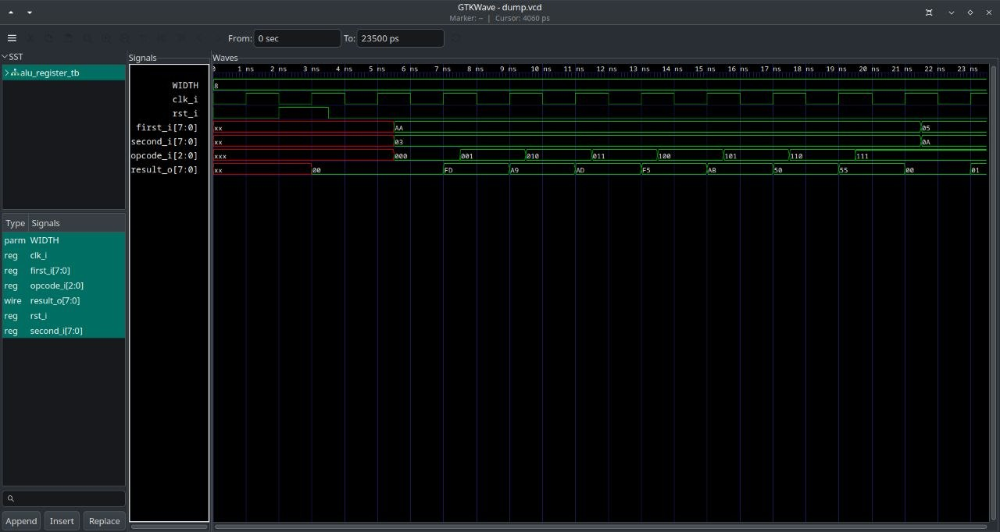

# ALU Register — Verilog Implementation

Реализация арифметико-логического устройства с синхронным выходным регистром на языке Verilog.

---

## Описание модуля

Модуль `alu_register` — это АЛУ с синхронным выходным регистром. Он выполняет 8 различных арифметических, логических операций и операций сдвига над двумя входными операндами в зависимости от 3-битного кода операции (`opcode_i`). Результат вычисления защёлкивается в выходной регистр по **положительному фронту** тактового сигнала.

---

## Параметры

| Параметр | По умолчанию | Описание |
|----------|:---:|---|
| `WIDTH` | `8` | Разрядность операндов и результата (любое целое положительное число) |

---

## Порты

| Название | Ширина | Направление | Описание |
|---|:---:|:---:|---|
| `clk_i` | 1 | Input | Тактовый сигнал |
| `rst_i` | 1 | Input | Сигнал сброса |
| `first_i` | `WIDTH` | Input | Первый операнд |
| `second_i` | `WIDTH` | Input | Второй операнд |
| `opcode_i` | 3 | Input | Код операции |
| `result_o` | `WIDTH` | Output | Результат операции |

---

## Система команд

| `opcode_i` | Операция |
|:---:|---|
| `3'b000` | Побитовое НЕ-И (`NAND`) |
| `3'b001` | Побитовое исключающее ИЛИ (`XOR`) |
| `3'b010` | Сложение без знака |
| `3'b011` | Арифметический (знаковый) сдвиг `first_i` вправо на `second_i` |
| `3'b100` | Побитовое ИЛИ (`OR`) |
| `3'b101` | Логический сдвиг `first_i` влево на `second_i` |
| `3'b110` | Побитовое НЕ для `first_i` |
| `3'b111` | Сравнение: `first_i < second_i` |

---

## Тактирование и сброс

- Тактирование — по **положительному фронту** `clk_i`.
- Сброс — **синхронный**, активный уровень **высокий** (`rst_i = 1`).
- При сбросе в регистр результата записывается `0` независимо от входных данных.

---

## Структура проекта

```
.
├── alu_register.v       # Реализация модуля
├── alu_register_tb.v    # Testbench
└── README.md
```

---

## Реализация

<details>
<summary>alu_register.v</summary>

```verilog
module alu_register #(parameter WIDTH = 8)
(
    input              clk_i,
    input              rst_i,
    input  [WIDTH-1:0] first_i,
    input  [WIDTH-1:0] second_i,
    input  [2:0]       opcode_i,
    output [WIDTH-1:0] result_o
);

    reg [WIDTH-1:0] result;

    always @(posedge clk_i)
    begin
        if(rst_i)
        begin
            result <= {WIDTH{1'b0}};
        end
        else
        begin
            case (opcode_i)
                3'b000: result <= ~(first_i & second_i);
                3'b001: result <= first_i ^ second_i;
                3'b010: result <= first_i + second_i;
                3'b011: result <= $signed(first_i) >>> second_i;
                3'b100: result <= first_i | second_i;
                3'b101: result <= first_i << second_i;
                3'b110: result <= ~first_i;
                3'b111: result <= {{(WIDTH-1){1'b0}}, (first_i < second_i)};
            endcase
        end
    end

    assign result_o = result;

endmodule
```
</details>
<br>

---

## Testbench

Сценарий тестирования:
1. Генерация тактового сигнала с периодом **2 нс**.
2. Подача импульса сброса на один такт.
3. Проверка всех 8 операций при `first_i = 8'b10101010`, `second_i = 8'b00000011`.
4. Дополнительная проверка операции сравнения (`opcode = 3'b111`) при `first_i = 5`, `second_i = 10`.

<details>
<summary>alu_register_tb.v</summary>

```verilog
`timescale 1ns/1ps

module alu_register_tb ();

    localparam WIDTH = 8;

    reg              clk_i;
    reg              rst_i;
    reg  [WIDTH-1:0] first_i;
    reg  [WIDTH-1:0] second_i;
    reg  [2:0]       opcode_i;
    wire [WIDTH-1:0] result_o;

    alu_register #(.WIDTH(WIDTH))
        alu_register_inst
        (
            .clk_i(clk_i),
            .rst_i(rst_i),
            .first_i(first_i),
            .second_i(second_i),
            .opcode_i(opcode_i),
            .result_o(result_o)
        );

    always
    begin
        clk_i = 1'b0; #1;
        clk_i = 1'b1; #1;
    end

    initial
    begin
        $dumpvars;
        rst_i = 1'b0;
        #2;
        rst_i = 1'b1;
        @(posedge clk_i); #0.5;
        rst_i = 1'b0;
        @(posedge clk_i); #0.5;

        first_i = 8'b10101010;
        second_i = 8'b00000011;
        opcode_i = 3'b000;
        @(posedge clk_i); #0.5;
        opcode_i = 3'b001;
        @(posedge clk_i); #0.5;
        opcode_i = 3'b010;
        @(posedge clk_i); #0.5;
        opcode_i = 3'b011;
        @(posedge clk_i); #0.5;
        opcode_i = 3'b100;
        @(posedge clk_i); #0.5;
        opcode_i = 3'b101;
        @(posedge clk_i); #0.5;
        opcode_i = 3'b110;
        @(posedge clk_i); #0.5;
        opcode_i = 3'b111;
        @(posedge clk_i); #0.5;
        first_i = 8'd5;
        second_i = 8'd10;
        opcode_i = 3'b111;
        @(posedge clk_i); #0.5;
        $finish;
    end

endmodule
```

</details>
<br>

## Результаты тестирования
 

 
---
